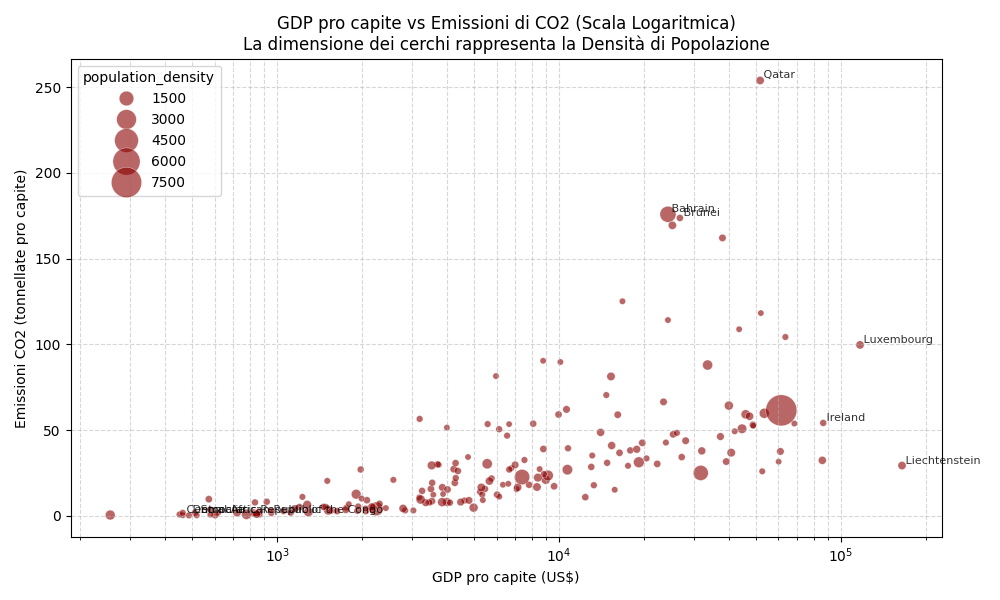
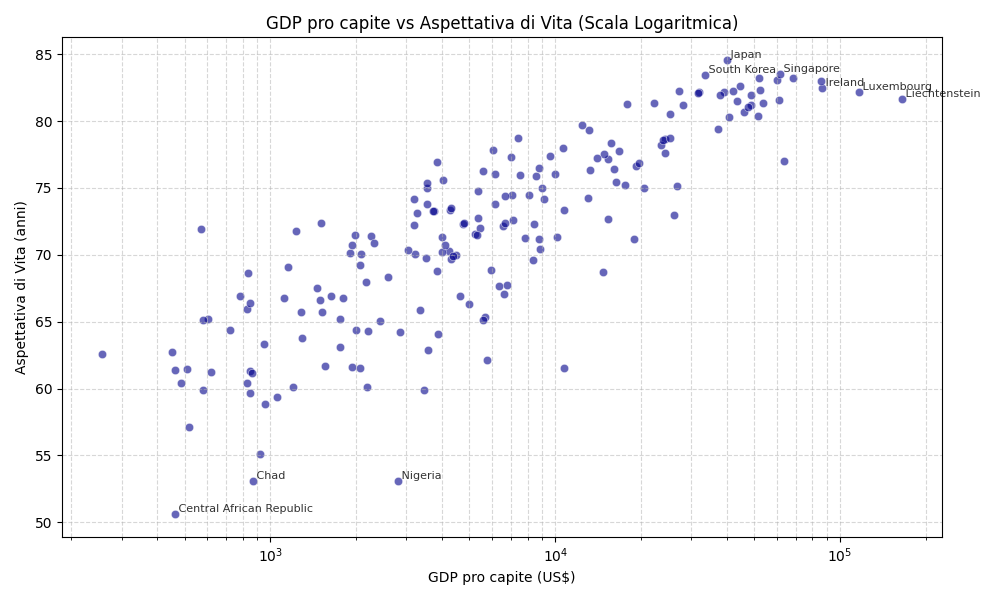

# Global Metrics 2020: L'Impatto Interconnesso di Ricchezza e Densità

## 🌍 Panoramica del Progetto
Questo progetto esplora le profonde correlazioni tra il potere economico di una nazione, la sua struttura demografica e i risultati in campo ambientale e sociale. Utilizzando i dati globali della Banca Mondiale per l'anno 2020, abbiamo analizzato 187 Nazioni con un approccio olistico per testare due ipotesi principali:
- **Il Costo Ambientale della Ricchezza e della Vicinanza**: I Paesi più ricchi (con alto GDP) e densamente popolati sono inevitabilmente i maggiori produttori di CO2 pro capite?
- **Il Dividendo sulla Salute**: Come impatta un alto GDP sull'aspettativa di vita, e in che modo la densità di popolazione funge da catalizzatore (o collo di bottiglia) per i risultati della sanità pubblica?

## 1.1 Specifiche del Progetto
Il progetto "Global Metrics" nasce come elaborato per il corso di Open Data Management (Laurea in Intelligenza Artificiale). L'obiettivo principale è la realizzazione di una pipeline end-to-end per l'estrazione, pulizia, trasformazione e arricchimento di open data, elevandone la qualità fino al livello massimo delle **5 stelle open data** (secondo il modello di Tim Berners-Lee).

I domini scelti per l'analisi sono indicatori globali di sviluppo socio-economico e ambientale. Nello specifico, sono stati selezionati 4 dataset della **World Bank**:
1. **Densità di Popolazione** (Population Density)
2. **PIL pro capite** (GDP per Capita)
3. **Aspettativa di Vita** (Life Expectancy)
4. **Emissioni di CO2** (CO2 Emissions)

I dati, originariamente in formato CSV (3 stelle), sono stati trasformati in un Knowledge Graph RDF (4 stelle) e successivamente interconnessi con **DBpedia** (5 stelle) creando una base di conoscenza interrogabile tramite SPARQL.

## 1.2 Struttura Moduli
```
opendata_flowlib/
├── __init__.py
├── reader/
│   ├── __init__.py
│   ├── file_reader.py       # Lettura locale: CSV, Excel, JSON, Parquet, PDF
│   └── remote_reader.py     # Lettura remota: HTTP/URL, CKAN, SPARQL endpoints
├── cleaner/
│   ├── __init__.py
│   ├── headers.py           # Normalizzazione delle intestazioni (snake_case, upper, pulizia)
│   ├── numbers.py           # Parsing numeri e rimozione suffissi
│   ├── types.py             # Casting automatico dei tipi e parsing date
│   ├── nulls.py             # Eliminazione e flagging righe con valori mancanti
│   └── dedup.py             # Rimozione di righe duplicate
├── processor/
│   ├── __init__.py
│   ├── filters.py           # Selezione/drop di colonne e filtraggio logico di righe
│   ├── aggregations.py      # Operazioni di groupby, pivot, melt
│   └── transformers.py      # Normalizzazione e aggiunta colonne calcolate
├── enricher/
│   ├── __init__.py
│   └── enricher.py          # Logica di JOIN semantica tramite file di lookup esterni (es. DBpedia)
├── visualizer/
│   ├── __init__.py
│   ├── charts.py            # Astrazioni per grafici Plotly e Matplotlib
│   └── reports.py           # Esportazione figure in HTML o PDF
└── pipeline/
    ├── __init__.py
    └── pipeline.py          # Motore principale `Pipeline` con pattern Fluent
```

## 1.3 Struttura di Esecuzione (Scripts)
Per mantenere separata la libreria dalle logiche specifiche di progetto, i file eseguibili sono stati ordinati tematicamente all'interno della directory `scripts/`:

```
.
├── run_pipeline.py                      # (Entry Point) Pulisce i CSV ed effettua l'interlinking
└── scripts/
    ├── data_preparation/
    │   └── bootstrap_lookup.py          # Estrae i mapping iniziali di DBpedia
    ├── analysis/
    │   ├── generate_charts.py           # Genera visualizzazioni grafiche 
    │   └── generate_index_and_map.py    # Calcola l'indice GSWI e mappa geografica
    └── semantic_web/
        ├── generate_rdf.py              # Costruisce il Knowledge Graph (.ttl)
        └── query_graph.py               # Analizza il Grafo RDF con SPARQL
```
*(Nota: Tutti gli script all'interno di `scripts/` sono configurati per risolvere automaticamente i percorsi relativi: possono essere eseguiti sia dalla root di progetto che dalle loro rispettive sottocartelle).*

## 2. Motivazioni sulle Scelte Tecniche

### 2.1 Architettura a Libreria (`opendata_flowlib`)
Si è optato per la creazione di una libreria Python modulare e riutilizzabile anziché scrivere script monolitici. 
- **Decoupling**: Separare le fasi di `reader`, `cleaner`, `processor`, `enricher` e `writer` garantisce la manutenibilità del codice.
- **Fluent Interface**: L'orchestratore `Pipeline` è stato progettato con una sintassi a concatenazione (method chaining). Questo pattern rende il codice altamente leggibile e auto-esplicativo (simile a PySpark o dplyr), permettendo di comprendere il flusso dei dati a colpo d'occhio.

### 2.2 Scelta dell'Anno Base (2020)
I dataset originali della World Bank presentano una struttura *wide* con una colonna per ogni anno dal 1960 a oggi. Al fine di produrre un'ontologia coerente e compatta e dimostrare in modo efficace l'interlinking, si è scelto di estrarre e consolidare unicamente i dati relativi all'anno **2020**. Questa scelta garantisce una buona copertura dei dati (gli anni troppo recenti presentano spesso molti valori nulli) e semplifica la rappresentazione semantica.

### 2.3 Creazione dell'Enricher e Interlinking
L'operazione chiave per raggiungere le 5 stelle è l'arricchimento. Poiché la World Bank fornisce già i codici nazione ISO, si è scelto di implementare un *enricher* che fa da ponte semantico: mappa il nome testuale della nazione in una **URI di DBpedia** (es. `http://dbpedia.org/resource/Italy`).
Questa operazione è fondamentale perché dimostra la capacità della pipeline di ancorare stringhe di testo a risorse univoche nel Web Semantico, aprendo la strada a query federate.

### 2.4 Ontologia e Namespaces
Non potendo disporre di un dominio reale, si è adottato un namespace verosimile e semanticamente corretto:
- `http://globalmetrics.org/resource/` per le istanze (le singole nazioni).
- `http://globalmetrics.org/ontology/` per le classi e le proprietà (es. `Country`, `hasGDPPerCapita`).
Si sono riutilizzati vocabolari standard come `rdfs:label` per i nomi, `xsd:float` per i datatype e `owl:Class`/`owl:ObjectProperty`/`owl:DatatypeProperty` per modellare correttamente il vocabolario. Inoltre, la proprietà custom `gmont:exactMatchDBpedia` è dichiarata come sottoproprietà di `owl:sameAs`, rispettando le best practice per l'interoperabilità.

### 3 📊 I Dati, Le Evidenze e il GSWI Index
I 187 paesi generano chiare correlazioni, immediatamente visibili attraverso l'analisi dei macro-dati.

### 3.1 Global Sustainability and Well-being Index (GSWI)
Per esplorare queste correlazioni in maniera olistica, abbiamo introdotto il **GSWI**. Questo indice sintetico (da 0 a 100) bilancia la ricchezza economica (PIL) e la salute pubblica (aspettativa di vita) con la pressione ambientale (emissioni di CO2 e densità di popolazione). La sua creazione si è resa necessaria per identificare non solo chi "produce di più", ma chi lo fa in modo **sostenibile**.

La combinazione di questi indicatori fa emergere casi "virtuosi" inaspettati: nazioni come l'**Uruguay** o la **Costa Rica** superano giganti economici grazie al loro impatto ecologico ridottissimo e a un'ottima aspettativa di vita. Al contrario, paesi ad alto reddito ma con emissioni critiche (es. **Bahrain**) crollano in fondo alla classifica.
Per una visualizzazione interattiva dei punteggi globali su **OpenStreetMap**, puoi consultare la mappa generata: [Mappa GSWI](charts/world_map.html).

### 3.2 Emissioni di CO2 e Ricchezza
Nei paesi ricchi le emissioni tendono a salire, ma la varianza della densità di popolazione rivela scenari inaspettati (i cerchi più ampi indicano nazioni più dense):


### 3.3 Aspettativa di Vita e Ricchezza
L'aumento esponenziale della ricchezza corrisponde quasi sempre a un forte salto in avanti nell'aspettativa di vita:


## 4 🔗 Il Knowledge Graph (Dati Linked Open 5★)
Anziché gestire dataset frammentati in silos paralleli (es. "GDP vs CO2" scollegato da "GDP vs Salute"), abbiamo unito i 4 dataset in un unico, compatto e potentissimo **Knowledge Graph RDF**.
Questa scelta architetturale ("meno file, ma migliori") ci permette di individuare le correlazioni olistiche (es. i paesi "paradiso" ricchi ma con poche emissioni).

* **Dimensioni e Nodi**: Il grafo completo (`global_metrics.ttl`) genera 1309 triple RDF ben modellate.
* **Classi e Vocabolari Controllati**: Ci avvaliamo rigorosamente dello standard `owl:Class` (per la definizione di `Country`) e usiamo `owl:DatatypeProperty` e `owl:ObjectProperty` per i collegamenti. Il vocabolario è arricchito con **SKOS** (`skos:prefLabel`, `skos:notation`, `skos:scopeNote`, `skos:definition`) per descrivere matematicamente gli indicatori. Sono stati inoltre integrati i vocabolari **PROV** (`prov:wasDerivedFrom`) per la tracciabilità delle fonti verso la World Bank, e **QUDT** (`qudt:unit`) per l'esplicita dichiarazione delle unità di misura.
* **Metadati di Sistema**: È presente un solido layer di classificazione descrittiva autogenerata tramite i vocabolari **VoID** e **DCAT**, che iniettano dinamicamente in `void.ttl` le statistiche strutturali (`void:triples`, `void:entities`), le attribuzioni d'autore e le licenze (`dcterms:issued`, `dcterms:creator`).
* **Interlinking a 5 Stelle**: Ciascuna delle nostre 187 entità nazionali è collegata direttamente al dataset enciclopedico di *DBpedia* tramite la property custom `gmont:exactMatchDBpedia`, che è dichiarata come sottoproprietà di `owl:sameAs`.

## 5 📁 Fonte dei Dati
Le 4 metriche originarie provengono dalla The World Bank (Banca Mondiale):
- [Population Density](https://data.worldbank.org/indicator/EN.POP.DNST)
- [GDP per capita](https://data.worldbank.org/indicator/NY.GDP.PCAP.CD)
- [Life Expectancy](https://data.worldbank.org/indicator/SP.DYN.LE00.IN)
- [CO2 Emissions](https://databank.worldbank.org/metadataglossary/world-development-indicators/series/EN.ATM.CO2E.PC)
    - [Source CO2](https://www.climatewatchdata.org/ghg-emissions)

## 6 ⚖️ Licenza
L'intero progetto e i dataset derivati (sia i file CSV normalizzati che il Grafo RDF) sono rilasciati liberamente sotto licenza **Creative Commons Attribution 4.0 (CC-BY-4.0)**.

---
> [!NOTE]
> Il dataset sulle emissioni di CO2 è stato ricavato dalla fonte indicata nel metadataglossary della WB (link al glossario e alla sorgente nel paragrafo 5: Fonte dei Dati)
> La cartella docs contiene i prompt usati per la generazione del progetto e i link alle chat che hanno portato alla loro creazione e successivo raffinamento
> Per dettagli tecnici, fai riferimento a questi documenti dedicati:
> - [ARCHITECTURE.md](opendata_flowlib/ARCHITECTURE.md): Descrizione granulare del funzionamento della pipeline dati.
> - [ONTOLOGY_AND_QUERIES.md](processed/ONTOLOGY_AND_QUERIES.md): Specifiche della T-Box (integrazione Protégé) e lista delle **Query SPARQL** d'esempio.
> - [data_quality_compliance_report.md](processed/data_quality_compliance_report.md): Rapporto di verifica sulla qualità dei dati aperti rispetto alle normative europee e alle cosiddette "buone pratiche"
> - [index_story.md](charts/index_story.md): Rapporto di verifica sulla qualità dei dati aperti rispetto alle normative europee e alle cosiddette "buone pratiche"